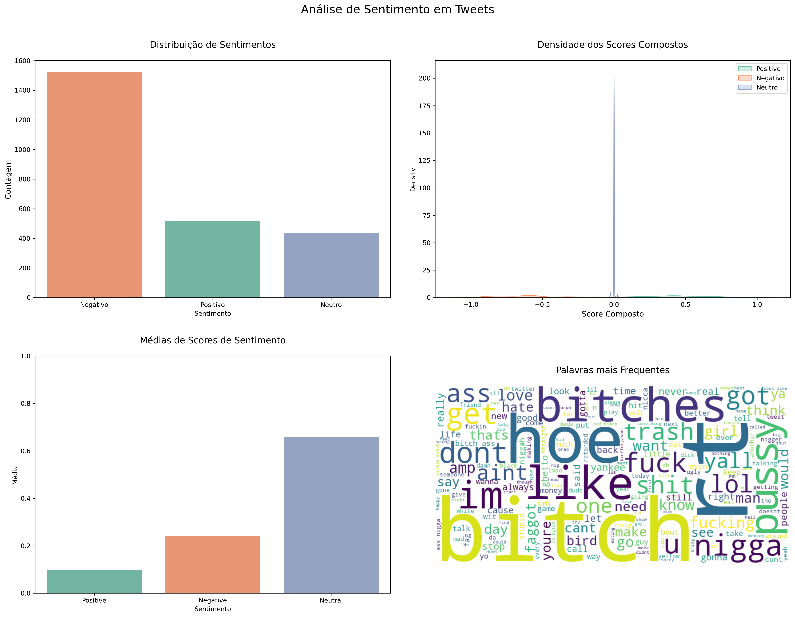

Here's a comprehensive README.md file for your Git repository:

```markdown
# Twitter Sentiment Analysis

A Python script for analyzing sentiment in Twitter data using Natural Language Processing (NLP) techniques.

## Features

- Text cleaning and preprocessing
- Sentiment analysis using VADER (Valence Aware Dictionary and sEntiment Reasoner)
- Sentiment classification (Positive, Negative, Neutral)
- Automated report generation with statistics
- Data visualization including:
  - Sentiment distribution
  - Score density plots
  - Comparative averages
  - Word cloud of most frequent terms

## Requirements

- Python 3.6+
- Required packages (listed in `requirements.txt`):
  ```
  pandas
  numpy
  matplotlib
  seaborn
  wordcloud
  nltk
  textblob
  ```

## Installation

1. Clone the repository:
   ```bash
   git clone https://github.com/yourusername/twitter-sentiment-analysis.git
   cd twitter-sentiment-analysis
   ```

2. Install the required packages:
   ```bash
   pip install -r requirements.txt
   ```

3. Download NLTK data:
   ```python
   import nltk
   nltk.download(['vader_lexicon', 'stopwords', 'punkt'])
   ```

## Usage

Simply run the script:
```bash
python sentiment_analysis.py
```

### Output Files

The script generates three output files:
1. `sentiment_analysis.csv` - Contains the original tweets with sentiment scores and classifications
2. `relatorio_sentimentos.md` - Markdown report with analysis statistics
3. `twitter_sentiment_analysis.png` - Visualizations of the analysis results

## Methodology

1. **Data Preparation**:
   - Loads Twitter data from a sample dataset
   - Applies text cleaning (lowercasing, removing URLs, punctuation, etc.)
   - Takes a 10% random sample for performance

2. **Sentiment Analysis**:
   - Uses NLTK's VADER sentiment analyzer
   - Calculates compound, positive, negative, and neutral scores
   - Classifies tweets as Positive (≥0.05), Negative (≤-0.05), or Neutral

3. **Reporting**:
   - Generates counts and distributions
   - Calculates average sentiment scores
   - Creates visualizations of results

## Customization

To analyze your own Twitter data:
1. Replace the URL in the script with your dataset path
2. Adjust the text cleaning function as needed for your data
3. Modify visualization parameters in the `create_visualizations()` function

## License

This project is open source and available under the [MIT License](LICENSE).

## Example Output


```

### Additional Recommendations:

1. Create a `requirements.txt` file with:
```
pandas
numpy
matplotlib
seaborn
wordcloud
nltk
textblob
```

2. Consider adding:
- A `.gitignore` file for Python
- A LICENSE file
- A directory for sample output files
- Jupyter Notebook version for interactive exploration

3. For a more professional setup, you might want to:
- Package the code as a Python module
- Add unit tests
- Set up CI/CD pipelines
- Create documentation with Sphinx
